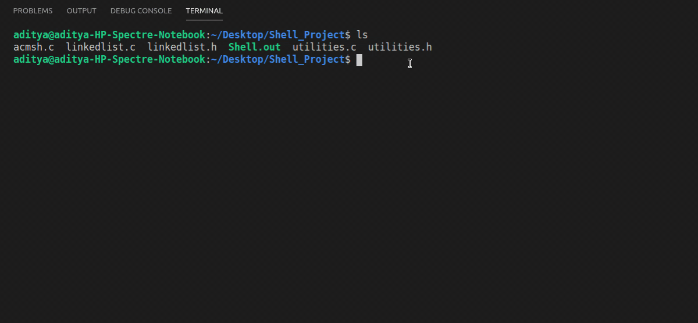

# LinuxShellProject

- This project consists for a basic iteration of C Shell, made in C language. This project has some exclusive custom commands, as well as the others which bash features.

# How to Use?

- Download the entire project, open up your terminal in Linux.
- Make sure you have GCC compiler installed. If you don't refer [here](https://linuxize.com/post/how-to-install-gcc-compiler-on-ubuntu-18-04/).
- If you want to compile the project (not needed), paste `gcc acmsh.c linkedlist.c utilities.c -o Shell.out` in your terminal.
- For running the Shell, paste `./Shell.out` inside your terminal.
- Enter `help` for list of commands.

# Tech Stack Used

- C language
- Some C libraries such as `<sys/wait.h>`,`<sys/types.h>` and `<signal.h>`.
- Libraries such as `<stdlib.h>`for adding color.

# Logic Used

- Providing a few built-in functions, and seeing whether the command entered by user matches them. If yes, we call our custom function, or we call our `sh_launch()` function.
- Important concepts in C such as `fork()` ,`exec()` and concepts of processes and their ID's.
- 
# Results obtained

- A fully working shell, which executes the normal functions of the default terminal, but also a few more custom functions so that the power user can use it to his ability.

# Existing Features

1. Custom `cd` command for changing directories.
2. Custom `exit` command for exiting the shell.
3. Running background jobs(by `sh_bg()` method) , listing all background jobs running at the moment (by `sh_bglist()` method) and also functionality to kill a running background job (`sh_kill()` method).

# New Features

1. `sh_history()` method : This method lists the latest 100 commands you have instructed to the Shell. It lists all these commands in chronological order. For avoiding usage of more memory, history automatically forgets the 100th oldest command issued. **Usage** : `history` if you want to view full history, or `history 3` if you want to list last 3 commands in the history.
2. `sh_again()` method : This method will help you to repeat any command in your history again by just entering the index for it in reverse order. **Usage** : `again 2` will run the second-last command given by you. This is obviously dependent on sh_history() method. Most recent command can be run by `again 1`.
3. `find_size()` method : This method finds the amount of functions that have been provided so that while iterating over all builtin functions, we can loop over all of them.
4. `sh_google()` method : This method will help you search google with whatever query you provide next to it. **Usage** : Simple `google` will open Google on your browser, and `google strings` will search strings on the same. You can also search for strings with multiple words separated by spaces.
5. `sh_pwd()` method : Prints present working directory. **Usage** : `pwd`.
6. `sh_help()` method : Lists all additional commands you can use. **Usage** : `help`.
7. `sh_about()` method : Lists my name. **Usage** : `about`
8. Color Coding : Additionally, all error messages are in red, all inputs are white, and messages from Shell itself are cyan for ease of use.

# Future Goals

- Adding more features, like auto-complete for names of files and folders so that it is as useful as a normal terminal.
- Adding more custom features to execute custom routines and automation.

# Working Demo
- Various features, including error handling is demonstated in the GIF below.

